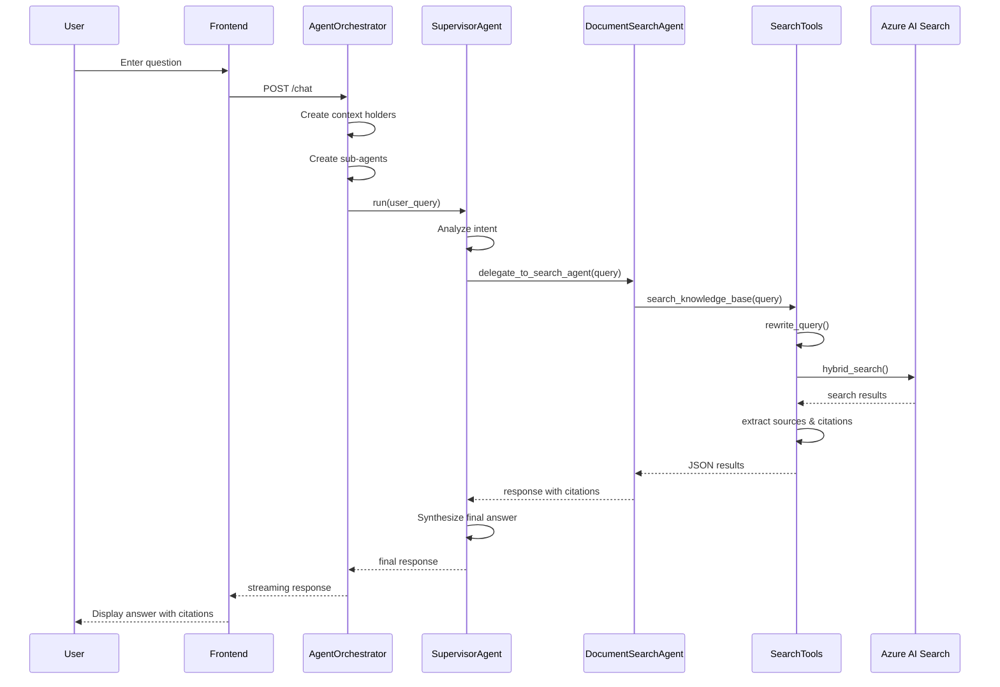

# AI Agent Framework: Complete Guide

This comprehensive guide covers everything about the AI Agent Framework implementation for the Azure-Search-OpenAI-Demo application. It includes the framework overview, architecture, implementation details, and feature documentation.

---

## Table of Contents

1. [Overview](#1-overview)
2. [Architecture and Design Patterns](#2-architecture-and-design-patterns)
3. [Project Structure](#3-project-structure)
4. [Core Components](#4-core-components)
5. [Tool Class Pattern](#5-tool-class-pattern)
6. [Step-by-Step Implementation Guide](#6-step-by-step-implementation-guide)
7. [Key Techniques and Concepts](#7-key-techniques-and-concepts)
8. [Technologies and Libraries](#8-technologies-and-libraries)
9. [Configuration and Environment Variables](#9-configuration-and-environment-variables)
10. [API Integration](#10-api-integration)
11. [Code Examples](#11-code-examples)
12. [Best Practices](#12-best-practices)
13. [Deployment Notes](#13-deployment-notes)
14. [Testing](#14-testing)
15. [Troubleshooting](#15-troubleshooting)
16. [Future Enhancements](#16-future-enhancements)
17. [References](#17-references)

---

## 1. Overview

### 1.1 What is the Agent Framework?

The AI Agent Framework transforms a traditional Retrieval-Augmented Generation (RAG) application into an intelligent, modular system where specialized agents collaborate to answer user queries. Instead of a monolithic approach, the framework employs a **hierarchical agent architecture** where a supervisor agent routes queries to specialized sub-agents based on intent classification.

### 1.2 Key Objectives

| Objective | Description |
|-----------|-------------|
| **Modularity** | Separate concerns into specialized agents (search, traversal, etc.) |
| **Extensibility** | Easy to add new agents for new capabilities |
| **Transparency** | Track agent reasoning through "thought steps" visible in the UI |
| **Reusability** | Tool classes can be shared across agents |
| **Scalability** | Each agent can be independently scaled or replaced |

### 1.3 Core Components

| Component | Purpose |
|-----------|---------|
| **SupervisorAgent** | Routes queries to appropriate sub-agents based on intent |
| **DocumentSearchAgent** | Handles search queries using Azure AI Search (RAG pipeline) |
| **GraphTraversalAgent** | Handles relationship/navigation queries (knowledge graph placeholder) |
| **Tool Classes** | Encapsulate functionality that agents can invoke |
| **Context Holders** | Manage state and accumulate results across tool invocations |

### 1.4 How It Fits in the RAG Application

```
┌─────────────────────────────────────────────────────────────────────────────────────┐
│                          AVAILABLE APPROACHES                                        │
├─────────────────────────────────────────────────────────────────────────────────────┤
│                                                                                      │
│  ┌─────────────────────────────┐     ┌─────────────────────────────────────────┐   │
│  │  RetrieveThenRead           │     │  ChatReadRetrieveRead                   │   │
│  │  (/ask endpoint)            │     │  (/chat endpoint)                       │   │
│  │                             │     │                                         │   │
│  │  • Single-turn Q&A          │     │  • Multi-turn conversation              │   │
│  │  • Direct search → answer   │     │  • Query rewriting from history         │   │
│  │  • No conversation memory   │     │  • Context-aware responses              │   │
│  └─────────────────────────────┘     └─────────────────────────────────────────┘   │
│                                                                                      │
│  ┌─────────────────────────────────────────────────────────────────────────────┐   │
│  │  AgentOrchestrator (when AGENT_FRAMEWORK_ENABLED=true)                       │   │
│  │                                                                               │   │
│  │  • Multi-agent hierarchical architecture                                     │   │
│  │  • Supervisor routes to specialized agents                                   │   │
│  │  • Extensible with custom tools                                              │   │
│  └─────────────────────────────────────────────────────────────────────────────┘   │
│                                                                                      │
└─────────────────────────────────────────────────────────────────────────────────────┘
```

---

## 2. Architecture and Design Patterns

### 2.1 Hierarchical Agent Pattern

The framework implements a **supervisor-worker pattern**:

```
┌─────────────────────────────────────────────────────────────────┐
│                        User Query                                │
└─────────────────────────────────────────────────────────────────┘
                              │
                              ▼
┌─────────────────────────────────────────────────────────────────┐
│                     SupervisorAgent                              │
│  - Analyzes query intent                                        │
│  - Routes to appropriate sub-agent(s)                           │
│  - Synthesizes final response with citations                    │
└─────────────────────────────────────────────────────────────────┘
                    │                       │
           ┌───────┴───────┐       ┌───────┴───────┐
           ▼               ▼       ▼               ▼
┌──────────────────┐   ┌──────────────────┐
│DocumentSearchAgent│   │GraphTraversalAgent│
│  - RAG pipeline   │   │  - Graph queries  │
│  - Hybrid search  │   │  - Relationships  │
│  - Citations      │   │  - Hierarchies    │
└──────────────────┘   └──────────────────┘
           │                       │
           ▼                       ▼
┌──────────────────┐   ┌──────────────────┐
│   SearchTools    │   │  TraversalTools  │
│search_knowledge_ │   │traverse_knowledge│
│      base        │   │     _graph       │
└──────────────────┘   └──────────────────┘
```

### 2.2 Design Patterns Used

#### 2.2.1 Factory Pattern
Agents are created through factory functions, enabling configuration injection:

```python
def create_supervisor_agent(
    chat_client: AzureOpenAIChatClient,
    supervisor_tools: SupervisorTools,
    include_traversal_agent: bool = False,
) -> ChatAgent:
    """Factory function to create a SupervisorAgent."""
```

#### 2.2.2 Strategy Pattern
The `Approach` base class allows swapping between different RAG strategies:
- `run_search_approach()` - Traditional hybrid search
- `run_agentic_retrieval_approach()` - AI-powered retrieval with reasoning

#### 2.2.3 Context Holder Pattern
State management through dataclass containers:

```python
@dataclass
class SearchContextHolder:
    chat_approach: Approach
    messages: list
    overrides: dict
    auth_claims: dict
    thoughts: list  # Shared list for UI visibility
    data_points: DataPoints  # Accumulated results
```

#### 2.2.4 Tool Pattern
Functions decorated with `@ai_function` become callable tools for agents:

```python
from agent_framework import ai_function

search_tool = ai_function(
    description="Search the knowledge base..."
)(search_tools.search_knowledge_base)
```

### 2.3 Full Architecture Diagram

```
┌─────────────────────────────────────────────────────────────────────────────────────┐
│                         Agent Framework Architecture                                 │
└─────────────────────────────────────────────────────────────────────────────────────┘

                              User Query
                                  │
                                  ▼
              ┌───────────────────────────────────────┐
              │          SupervisorAgent              │
              │  ┌─────────────────────────────────┐  │
              │  │ • Analyzes query intent          │  │
              │  │ • Selects appropriate sub-agent  │  │
              │  │ • Synthesizes final response     │  │
              │  │ • Preserves citations            │  │
              │  └─────────────────────────────────┘  │
              │                                       │
              │  Tools:                               │
              │  • delegate_to_search_agent()        │
              │  • delegate_to_traversal_agent()     │
              └───────────────────────────────────────┘
                         │                │
          ┌──────────────┘                └──────────────┐
          ▼                                              ▼
┌──────────────────────────┐            ┌──────────────────────────┐
│  DocumentSearchAgent     │            │  GraphTraversalAgent     │
│  ┌────────────────────┐  │            │  ┌────────────────────┐  │
│  │ Handles:           │  │            │  │ Handles:           │  │
│  │ • Factual queries  │  │            │  │ • Relationship Qs  │  │
│  │ • Policy lookups   │  │            │  │ • Org structure    │  │
│  │ • Benefit details  │  │            │  │ • Team connections │  │
│  └────────────────────┘  │            │  └────────────────────┘  │
│                          │            │                          │
│  Tool:                   │            │  Tool:                   │
│  search_knowledge_base() │            │  traverse_knowledge_     │
│  (Full RAG pipeline)     │            │  graph() [Placeholder]   │
└──────────────────────────┘            └──────────────────────────┘
          │                                              │
          ▼                                              ▼
┌──────────────────────────┐            ┌──────────────────────────┐
│    Azure AI Search       │            │    Knowledge Graph       │
│    (Hybrid Search)       │            │    (Future)              │
└──────────────────────────┘            └──────────────────────────┘
```

### 2.4 Agent Interaction Sequence



---

## 3. Project Structure

### 3.1 New Folder Structure

```
app/backend/approaches/
├── agents/                              # Agent implementations
│   ├── __init__.py                      # Exports AgentOrchestrator and factory functions
│   ├── agent_orchestrator.py            # Main AgentOrchestrator class
│   ├── document_search_agent.py         # DocumentSearchAgent factory function
│   ├── graph_traversal_agent.py         # GraphTraversalAgent factory function
│   └── supervisor_agent.py              # SupervisorAgent factory function
├── tools/                               # Tool implementations (using @ai_function pattern)
│   ├── __init__.py                      # Exports tool classes
│   ├── search_tools.py                  # SearchTools class with search_knowledge_base
│   ├── traversal_tools.py               # TraversalTools class with traverse_knowledge_graph
│   └── supervisor_tools.py              # SupervisorTools class for agent delegation
├── prompts/
│   ├── agents/                          # Agent-specific prompts (for UI display)
│   │   ├── supervisor_agent.prompty     # Supervisor agent prompt
│   │   ├── document_search_agent.prompty # Search agent prompt
│   │   └── graph_traversal_agent.prompty # Traversal agent prompt
│   └── ... (existing prompts)
└── ... (existing files)
```

### 3.2 Complete File Structure

```
app/backend/
├── approaches/
│   ├── approach.py                 # Base Approach class
│   ├── chatreadretrieveread.py     # Traditional RAG approach
│   ├── agents/
│   │   ├── __init__.py
│   │   ├── agent_orchestrator.py   # Main orchestrator
│   │   ├── document_search_agent.py
│   │   ├── graph_traversal_agent.py
│   │   └── supervisor_agent.py
│   ├── tools/
│   │   ├── __init__.py
│   │   ├── search_tools.py         # SearchTools, SearchContextHolder
│   │   ├── supervisor_tools.py     # SupervisorTools
│   │   └── traversal_tools.py      # TraversalTools
│   └── prompts/
│       ├── chat_query_rewrite.prompty
│       ├── chat_answer_question.prompty
│       └── agents/
│           ├── supervisor_agent.prompty
│           ├── document_search_agent.prompty
│           └── graph_traversal_agent.prompty
├── app.py                          # Main application entry
└── requirements.txt
```

---

## 4. Core Components

### 4.1 Agent Types

| Agent | Purpose | Tool |
|-------|---------|------|
| **SupervisorAgent** | Routes queries to appropriate sub-agents | `delegate_to_*` |
| **DocumentSearchAgent** | Handles factual/search queries | `search_knowledge_base()` |
| **GraphTraversalAgent** | Handles relationship queries (placeholder) | `traverse_knowledge_graph()` |

### 4.2 Agent Creation Pattern

```python
# Supervisor agent (main orchestration agent)
self.supervisor_agent = ChatAgent(
    name="SupervisorAgent",
    chat_client=self.agent_client,
    instructions="...",
    tools=[delegate_to_search_agent, delegate_to_traversal_agent],
)

# Document search agent with Azure AI Search tool
self.document_search_agent = ChatAgent(
    name="DocumentSearchAgent",
    chat_client=self.agent_client,
    instructions="...",
    tools=[search_knowledge_base],
)

# Graph traversal agent (placeholder)
self.graph_traversal_agent = ChatAgent(
    name="GraphTraversalAgent",
    chat_client=self.agent_client,
    instructions="...",
    tools=[traverse_knowledge_graph],
)
```

### 4.3 Citation Preservation

The agents are instructed to preserve citations in the exact format `[filename.pdf-pagenumber]`:

- `[role_library.pdf-17]`
- `[employee_handbook.pdf-5]`

### 4.4 Thought Steps Integration

ThoughtSteps are recorded throughout the orchestration flow for UI visibility:

1. Supervisor Agent Prompt
2. Agent Routing
3. DocumentSearchAgent Invoked
4. DocumentSearchAgent Results
5. GraphTraversalAgent Invoked (if used)
6. GraphTraversalAgent Results (if used)
7. Supervisor Agent Response

---

## 5. Tool Class Pattern

The agent framework uses the `@ai_function` decorator pattern for tool classes. This provides:

1. **Separation of Concerns**: Tools are organized into dedicated classes
2. **Context Management**: State is managed via context holders
3. **Type Safety**: Pydantic annotations provide clear parameter descriptions
4. **Reusability**: Tool classes can be instantiated with different configurations

### 5.1 SearchTools Class (`search_tools.py`)

```python
from typing import Annotated
from pydantic import Field
from dataclasses import dataclass, field
from approaches.approach import Approach, DataPoints, ThoughtStep

@dataclass
class SearchContextHolder:
    """Context holder for SearchTools - manages state for tool execution."""
    chat_approach: Approach
    messages: list
    overrides: dict
    auth_claims: dict
    thoughts: list[ThoughtStep] = field(default_factory=list)
    data_points: DataPoints = field(default_factory=lambda: DataPoints(text=[], images=[], citations=[]))


class SearchTools:
    """Tool class for document search operations using @ai_function pattern."""
    
    def __init__(self, context_holder: SearchContextHolder):
        self.context = context_holder

    async def search_knowledge_base(
        self,
        search_query: Annotated[str, Field(description="The search query to find relevant information.")],
    ) -> str:
        """Search the knowledge base using the full RAG pipeline."""
        # Uses chat_approach.run_search_approach internally
        ...

    async def search_hybrid_simple(
        self,
        search_query: Annotated[str, Field(description="The search query for hybrid search.")],
    ) -> str:
        """Direct hybrid search without query rewriting."""
        ...
```

### 5.2 TraversalTools Class (`traversal_tools.py`)

```python
class TraversalTools:
    """Tool class for graph traversal operations using @ai_function pattern."""
    
    async def traverse_knowledge_graph(
        self,
        path: Annotated[str, Field(description="The navigation path or relationship to traverse.")],
    ) -> str:
        """Traverse the knowledge graph to find relationships."""
        ...

    async def explore_document_relationships(
        self,
        document_id: Annotated[str, Field(description="The document ID to explore relationships for.")],
    ) -> str:
        """Explore relationships starting from a document."""
        ...
```

### 5.3 SupervisorTools Class (`supervisor_tools.py`)

```python
class SupervisorTools:
    """Tool class for supervisor agent routing operations."""
    
    def __init__(
        self,
        document_search_agent: ChatAgent,
        graph_traversal_agent: ChatAgent,
    ):
        self.document_search_agent = document_search_agent
        self.graph_traversal_agent = graph_traversal_agent
        self._current_thoughts: list[ThoughtStep] = []

    def set_context(self, thoughts: list[ThoughtStep]) -> None:
        """Set the context for the current request."""
        self._current_thoughts = thoughts

    async def delegate_to_search_agent(
        self,
        query: Annotated[str, Field(description="A search query for the knowledge base.")],
    ) -> str:
        """Delegate query to DocumentSearchAgent."""
        ...

    async def delegate_to_traversal_agent(
        self,
        query: Annotated[str, Field(description="A query about relationships or connections.")],
    ) -> str:
        """Delegate query to GraphTraversalAgent."""
        ...
```

### 5.4 Using Tool Classes in AgentOrchestrator

```python
from agent_framework import ChatAgent, ai_function
from approaches.tools import SearchTools, TraversalTools, SupervisorTools, SearchContextHolder

class AgentOrchestrator:
    def __init__(self, ...):
        # Initialize context holder
        self._search_context_holder = SearchContextHolder(
            chat_approach=chat_approach,
            messages=[],
            overrides={},
            auth_claims={},
            thoughts=[],
            data_points=DataPoints(text=[], images=[], citations=[]),
        )

        # Initialize tool classes
        self.search_tools = SearchTools(context_holder=self._search_context_holder)
        self.traversal_tools = TraversalTools()

        # Create ai_function decorated tools
        search_knowledge_base_tool = ai_function(
            description="Search the knowledge base for relevant information."
        )(self.search_tools.search_knowledge_base)

        traverse_knowledge_graph_tool = ai_function(
            description="Traverse the knowledge graph for relationships."
        )(self.traversal_tools.traverse_knowledge_graph)

        # Create agents with decorated tools
        self.document_search_agent = ChatAgent(
            name="DocumentSearchAgent",
            chat_client=self.agent_client,
            instructions="...",
            tools=[search_knowledge_base_tool],
        )

        self.graph_traversal_agent = ChatAgent(
            name="GraphTraversalAgent",
            chat_client=self.agent_client,
            instructions="...",
            tools=[traverse_knowledge_graph_tool],
        )

        # Initialize supervisor tools with sub-agents
        self.supervisor_tools = SupervisorTools(
            document_search_agent=self.document_search_agent,
            graph_traversal_agent=self.graph_traversal_agent,
        )

        # Create supervisor delegation tools
        delegate_to_search_agent_tool = ai_function(
            description="Delegate to DocumentSearchAgent for search queries."
        )(self.supervisor_tools.delegate_to_search_agent)

        self.supervisor_agent = ChatAgent(
            name="SupervisorAgent",
            chat_client=self.agent_client,
            instructions="...",
            tools=[delegate_to_search_agent_tool],
        )

    def _update_tool_contexts(self, messages, overrides, auth_claims, thoughts, data_points):
        """Update tool contexts before each request."""
        self._search_context_holder.messages = messages
        self._search_context_holder.overrides = overrides
        self._search_context_holder.auth_claims = auth_claims
        self._search_context_holder.thoughts = thoughts
        self._search_context_holder.data_points = data_points
        
        self.supervisor_tools.set_context(thoughts=thoughts)
```

---

## 6. Step-by-Step Implementation Guide

### Step 1: Set Up the Base Approach Class

The `Approach` base class provides foundational capabilities:

```python
class Approach(ABC):
    """Base class for RAG approaches with shared methods."""
    
    def __init__(
        self,
        search_client: SearchClient,
        openai_client: AsyncAzureOpenAI,
        chatgpt_model: str,
        embedding_model: str,
        ...
    ):
        self.search_client = search_client
        self.openai_client = openai_client
        ...
```

**Key Methods:**
- `compute_text_embedding()` - Generate embeddings for search
- `search()` - Execute hybrid search against Azure AI Search
- `rewrite_query()` - LLM-based query optimization
- `create_chat_completion()` - OpenAI API wrapper

### Step 2: Create Tool Classes

Tool classes encapsulate agent capabilities:

```python
class SearchTools:
    """Tool class for document search operations."""
    
    def __init__(self, context_holder: SearchContextHolder):
        self.context = context_holder
    
    async def search_knowledge_base(
        self,
        search_query: Annotated[str, Field(description="Search query")]
    ) -> str:
        """Search using full RAG pipeline."""
        # 1. Query rewriting
        # 2. Hybrid search (text + vector + semantic)
        # 3. Source extraction
        ...
```

### Step 3: Create Agent Factory Functions

Factory functions create configured agents:

```python
def create_document_search_agent(
    chat_client: AzureOpenAIChatClient,
    search_tools: SearchTools,
) -> ChatAgent:
    """Factory function to create DocumentSearchAgent."""
    
    search_tool = ai_function(
        description="Search the knowledge base..."
    )(search_tools.search_knowledge_base)
    
    return ChatAgent(
        name="DocumentSearchAgent",
        chat_client=chat_client,
        instructions=DOCUMENT_SEARCH_AGENT_INSTRUCTIONS,
        tools=[search_tool],
    )
```

### Step 4: Create the Supervisor Agent

The supervisor routes queries to sub-agents:

```python
SUPERVISOR_INSTRUCTIONS = """You are a supervisor managing specialist agents:
1. delegate_to_search_agent: For search/retrieval queries
2. delegate_to_traversal_agent: For relationship/navigation queries

ALWAYS call at least one agent before providing your final answer.
Preserve ALL citations exactly as provided by sub-agents."""
```

### Step 5: Implement the Orchestrator

The orchestrator ties everything together:

```python
class AgentOrchestrator(Approach):
    """Orchestrates hierarchical agent architecture."""
    
    async def run(self, messages, overrides, auth_claims):
        # 1. Create tool instances with context
        search_context = SearchContextHolder(
            chat_approach=self,
            messages=messages,
            overrides=overrides,
            ...
        )
        search_tools = SearchTools(context_holder=search_context)
        
        # 2. Create sub-agents
        document_search_agent = create_document_search_agent(
            chat_client=self.chat_client,
            search_tools=search_tools,
        )
        
        # 3. Create supervisor with sub-agents
        supervisor_tools = SupervisorTools(
            document_search_agent=document_search_agent,
            ...
        )
        supervisor = create_supervisor_agent(
            chat_client=self.chat_client,
            supervisor_tools=supervisor_tools,
        )
        
        # 4. Run supervisor
        response = await supervisor.run(user_query)
        return response
```

### Step 6: Enable Framework via Environment Variable

Control framework activation through configuration:

```python
# In app.py
AGENT_FRAMEWORK_ENABLED = os.getenv("AGENT_FRAMEWORK_ENABLED", "false").lower() == "true"

if AGENT_FRAMEWORK_ENABLED:
    approaches["agent"] = AgentOrchestrator(...)
else:
    approaches["chat"] = ChatReadRetrieveReadApproach(...)
```

---

## 7. Key Techniques and Concepts

### 7.1 Orchestration Techniques

#### Intent-Based Routing
The supervisor analyzes query intent using instruction prompts:

```
For questions about WHAT something is → use delegate_to_search_agent
For questions about HOW things RELATE → use delegate_to_traversal_agent
For questions that need BOTH → call BOTH agents
```

#### Multi-Agent Delegation
The supervisor can call multiple sub-agents and synthesize responses:

```python
async def delegate_to_search_agent(self, query: str) -> str:
    """Delegate to DocumentSearchAgent."""
    response = await self.document_search_agent.run(query)
    return response.text
```

### 7.2 Memory and Context Management

#### Short-Term Memory (Conversation Context)
Messages are passed through the agent hierarchy:

```python
messages: list[ChatCompletionMessageParam]  # Conversation history
```

#### Context Holders for State
Accumulate results and thoughts across tool invocations:

```python
@dataclass
class SearchContextHolder:
    thoughts: list  # Accumulates reasoning steps
    data_points: DataPoints  # Accumulates sources, citations, images
```

### 7.3 Reasoning and Transparency

#### Thought Steps
Track agent reasoning for UI visibility:

```python
@dataclass
class ThoughtStep:
    title: str
    description: str
    props: Optional[dict] = None

# Example usage
thoughts.append(ThoughtStep(
    title="DocumentSearchAgent Invoked",
    description=f"Delegating query: '{query}'",
    props={"agent": "DocumentSearchAgent", "query": query}
))
```

#### Query Rewriting
LLM optimizes user queries for better search:

```python
async def rewrite_query(self, messages: list) -> str:
    """Use LLM to generate optimal search query."""
    # Uses chat_query_rewrite.prompty template
    response = await self.create_chat_completion(
        prompt_name="chat_query_rewrite",
        messages=messages,
    )
    return response.choices[0].message.content
```

### 7.4 Tool Function Pattern

#### @ai_function Decorator
Marks methods as callable tools for agents:

```python
from agent_framework import ai_function

@ai_function(description="Search the knowledge base")
async def search_knowledge_base(self, query: str) -> str:
    ...
```

#### Pydantic Field Annotations
Provide rich parameter descriptions:

```python
from pydantic import Field
from typing import Annotated

async def search(
    self,
    search_query: Annotated[
        str, 
        Field(description="The search query to find relevant information")
    ]
) -> str:
```

---

## 8. Technologies and Libraries

### 8.1 Core Framework

| Library | Version | Purpose |
|---------|---------|---------|
| `agent-framework-core` | ≥1.0.0b251120 | Microsoft Agent Framework for building AI agents |
| `openai` | ≥1.0 | OpenAI API client |
| `azure-search-documents` | 11.x | Azure AI Search SDK |
| `prompty` | 0.1.50 | Prompt template management |

### 8.2 Azure Services

| Service | Purpose |
|---------|---------|
| **Azure OpenAI** | GPT-4.1-mini for chat, text-embedding-3-large for embeddings |
| **Azure AI Search** | Hybrid search with semantic ranker |
| **Azure Container Apps** | Backend hosting |
| **Azure Functions** | Document processing (extractor, figure processor, text processor) |
| **Azure Blob Storage** | Document storage |
| **Azure Document Intelligence** | PDF parsing and extraction |

### 8.3 Python Libraries

| Library | Purpose |
|---------|---------|
| `quart` | Async web framework (Flask-compatible) |
| `pydantic` | Data validation and Field annotations |
| `dataclasses` | State management (context holders) |
| `asyncio` | Async/await patterns |
| `typing` | Type hints (Annotated, AsyncGenerator) |

### 8.4 Frontend Technologies

| Technology | Purpose |
|------------|---------|
| **React** | UI framework |
| **TypeScript** | Type-safe JavaScript |
| **Vite** | Build tool |
| **Fluent UI** | Microsoft design system |

### 8.5 New Dependency

The `requirements.txt` was regenerated using:

```powershell
cd app/backend
uv pip compile requirements.in -o requirements.txt --python-version 3.10 --prerelease=allow --upgrade
```

**Important**: The `pywin32` package was removed from `requirements.txt` as it's Windows-only and cannot be installed in the Linux container on Azure. The `mcp` package (dependency of agent-framework) works without it on Linux.

---

## 9. Configuration and Environment Variables

### 9.1 Environment Variables

| Variable | Description | Default |
|----------|-------------|---------|
| `AGENT_FRAMEWORK_ENABLED` | Enable the agent framework orchestration | `false` |
| `AZURE_OPENAI_ENDPOINT` | Azure OpenAI service endpoint | Required |
| `AZURE_OPENAI_CHATGPT_DEPLOYMENT` | GPT model deployment name | `gpt-4.1-mini` |
| `AZURE_OPENAI_EMB_DEPLOYMENT` | Embedding model deployment | `text-embedding-3-large` |
| `AZURE_SEARCH_SERVICE` | Azure AI Search service name | Required |
| `AZURE_SEARCH_INDEX` | Search index name | `gptkb` |
| `AZURE_SEARCH_SEMANTIC_RANKER` | Semantic ranker configuration | `free` |

### 9.2 How to Enable

#### Local Development

```powershell
azd env set AGENT_FRAMEWORK_ENABLED true
```

#### Azure Deployment

```powershell
azd env set AGENT_FRAMEWORK_ENABLED true
azd up
```

Or set in Azure Portal under Container App environment variables.

### 9.3 Infrastructure Changes

#### `infra/main.bicep`

```bicep
param agentFrameworkEnabled bool = false
AGENT_FRAMEWORK_ENABLED: agentFrameworkEnabled
```

#### `infra/main.parameters.json`

```json
"agentFrameworkEnabled": {
  "value": "${AGENT_FRAMEWORK_ENABLED=false}"
}
```

#### `.github/workflows/azure-dev.yml`

```yaml
AGENT_FRAMEWORK_ENABLED: ${{ vars.AGENT_FRAMEWORK_ENABLED }}
```

#### `.azdo/pipelines/azure-dev.yml`

```yaml
AGENT_FRAMEWORK_ENABLED: $(AGENT_FRAMEWORK_ENABLED)
```

---

## 10. API Integration

### 10.1 Backend Integration (`app.py`)

#### Import Changes

```python
# Import the AgentOrchestrator
from approaches.agents import AgentOrchestrator
```

#### Agent Orchestrator Setup

```python
# Initialize agent orchestrator when AGENT_FRAMEWORK_ENABLED is true
AGENT_FRAMEWORK_ENABLED = os.getenv("AGENT_FRAMEWORK_ENABLED", "").lower() == "true"

if AGENT_FRAMEWORK_ENABLED:
    agent_orchestrator = AgentOrchestrator(
        chat_approach=chat_approach,
        ask_approach=current_app.config[CONFIG_ASK_APPROACH],
        openai_endpoint=orchestration_endpoint,
        openai_deployment=AZURE_OPENAI_CHATGPT_DEPLOYMENT,
        prompt_manager=prompt_manager,
        search_client=current_app.config[CONFIG_SEARCH_CLIENT],
        openai_client=current_app.config[CONFIG_OPENAI_CLIENT],
        embedding_deployment=AZURE_OPENAI_EMB_DEPLOYMENT,
        credential_provider=sync_credential,
        api_key=AZURE_OPENAI_API_KEY_OVERRIDE,
    )
    current_app.config[CONFIG_AGENT_ORCHESTRATOR] = agent_orchestrator
```

### 10.2 Configuration Constants (`config.py`)

```python
CONFIG_AGENT_FRAMEWORK_ENABLED = "agent_framework_enabled"
CONFIG_AGENT_ORCHESTRATOR = "agent_orchestrator"
```

### 10.3 API Request/Response Format

#### Request
```json
{
  "messages": [
    {"role": "user", "content": "What are the health benefits?"}
  ],
  "context": {
    "overrides": {
      "retrieval_mode": "hybrid",
      "semantic_ranker": true,
      "top": 3
    }
  },
  "session_state": null
}
```

#### Response
```json
{
  "message": {
    "role": "assistant",
    "content": "The company offers several health benefits including... [Northwind_Health_Plus.pdf-1]"
  },
  "context": {
    "thoughts": [
      {
        "title": "SupervisorAgent Routing",
        "description": "Analyzing query intent...",
        "props": {"agent": "SupervisorAgent"}
      },
      {
        "title": "DocumentSearchAgent Invoked",
        "description": "Delegating query: 'What are the health benefits?'",
        "props": {"agent": "DocumentSearchAgent", "query": "..."}
      }
    ],
    "data_points": {
      "text": ["Source 1 content...", "Source 2 content..."],
      "citations": [...]
    },
    "followup_questions": [
      "What is the deductible?",
      "How do I enroll?"
    ]
  },
  "session_state": "abc123"
}
```

---

## 11. Code Examples

### 11.1 Creating a New Tool Class

```python
"""Example: Custom Analytics Tools"""

from typing import Annotated
from pydantic import Field
from approaches.approach import ThoughtStep

class AnalyticsTools:
    """Tools for data analytics queries."""
    
    def __init__(self, analytics_client):
        self.client = analytics_client
        self._current_thoughts: list[ThoughtStep] = []
    
    def set_context(self, thoughts: list[ThoughtStep]):
        self._current_thoughts = thoughts
    
    async def run_analytics_query(
        self,
        metric: Annotated[str, Field(description="The metric to analyze")],
        time_range: Annotated[str, Field(description="Time range (e.g., '7d', '30d')")],
    ) -> str:
        """Run an analytics query."""
        self._current_thoughts.append(ThoughtStep(
            title="Analytics Query",
            description=f"Analyzing {metric} for {time_range}",
            props={"metric": metric, "time_range": time_range}
        ))
        
        result = await self.client.query(metric, time_range)
        return json.dumps(result)
```

### 11.2 Creating a New Agent

```python
"""Example: Analytics Agent Factory"""

from agent_framework import ChatAgent, ai_function
from agent_framework.azure import AzureOpenAIChatClient

ANALYTICS_AGENT_INSTRUCTIONS = """You are an analytics specialist.
Use the run_analytics_query tool to analyze metrics and data.
Always explain the results clearly with context."""

def create_analytics_agent(
    chat_client: AzureOpenAIChatClient,
    analytics_tools: AnalyticsTools,
) -> ChatAgent:
    """Factory to create AnalyticsAgent."""
    
    query_tool = ai_function(
        description="Run analytics queries on business metrics"
    )(analytics_tools.run_analytics_query)
    
    return ChatAgent(
        name="AnalyticsAgent",
        chat_client=chat_client,
        instructions=ANALYTICS_AGENT_INSTRUCTIONS,
        tools=[query_tool],
    )
```

### 11.3 Adding Agent to Supervisor

```python
# In supervisor_tools.py
async def delegate_to_analytics_agent(
    self,
    query: Annotated[str, Field(description="Analytics query")],
) -> str:
    """Delegate to AnalyticsAgent for data analysis."""
    self._current_thoughts.append(ThoughtStep(
        title="AnalyticsAgent Invoked",
        description=f"Delegating: '{query}'",
    ))
    
    response = await self.analytics_agent.run(query)
    return response.text
```

### 11.4 Full Orchestration Example

```python
async def run_with_agent_framework(
    self,
    messages: list,
    overrides: dict,
    auth_claims: dict,
) -> dict:
    """Run query through agent framework."""
    
    # Initialize shared state
    thoughts: list[ThoughtStep] = []
    data_points = DataPoints(text=[], images=[], citations=[])
    
    # Create search tools with context
    search_context = SearchContextHolder(
        chat_approach=self,
        messages=messages,
        overrides=overrides,
        auth_claims=auth_claims,
        thoughts=thoughts,
        data_points=data_points,
    )
    search_tools = SearchTools(context_holder=search_context)
    
    # Create agents
    document_search_agent = create_document_search_agent(
        chat_client=self.chat_client,
        search_tools=search_tools,
    )
    
    traversal_tools = TraversalTools()
    traversal_tools.set_context(thoughts)
    graph_traversal_agent = create_graph_traversal_agent(
        chat_client=self.chat_client,
        traversal_tools=traversal_tools,
    )
    
    # Create supervisor
    supervisor_tools = SupervisorTools(
        document_search_agent=document_search_agent,
        graph_traversal_agent=graph_traversal_agent,
    )
    supervisor_tools.set_context(thoughts)
    
    supervisor = create_supervisor_agent(
        chat_client=self.chat_client,
        supervisor_tools=supervisor_tools,
        include_traversal_agent=True,
    )
    
    # Run supervisor
    user_query = messages[-1]["content"]
    response = await supervisor.run(user_query)
    
    return {
        "message": {"content": response.text, "role": "assistant"},
        "context": {
            "thoughts": [asdict(t) for t in thoughts],
            "data_points": asdict(data_points),
        }
    }
```

---

## 12. Best Practices

### 12.1 Agent Design

- **Single Responsibility**: Each agent should have one clear purpose
- **Clear Instructions**: Write detailed, unambiguous agent instructions
- **Citation Preservation**: Always preserve citation formats in supervisor synthesis
- **Error Handling**: Wrap tool calls in try/except and return error JSON

### 12.2 Tool Design

- **Descriptive Annotations**: Use `Annotated[type, Field(description=...)]` for all parameters
- **JSON Responses**: Return JSON strings for structured data
- **Context Accumulation**: Append to shared thoughts/data_points lists
- **Logging**: Log all tool invocations with parameters and results

### 12.3 Performance

- **Lazy Agent Creation**: Create agents per-request to avoid stale state
- **Connection Pooling**: Reuse HTTP clients across requests
- **Streaming**: Implement streaming for long responses
- **Caching**: Cache embeddings and frequent search results

### 12.4 Testing

- **Unit Tests**: Test each tool class independently with mocked dependencies
- **Integration Tests**: Test agent interactions with mocked LLM responses
- **E2E Tests**: Test full flow with Playwright and snapshot testing

### 12.5 Security

- **Auth Claims**: Pass authentication context through the agent hierarchy
- **Input Validation**: Validate all tool parameters
- **Output Sanitization**: Sanitize agent responses before returning to client

---

## 13. Deployment Notes

### 13.1 Package Installation Issues

During deployment, several package issues were encountered and resolved:

1. **pywin32**: Removed from requirements.txt (Windows-only)
2. **Pillow**: May need reinstallation if `_imaging` module errors occur
3. **tiktoken**: May need reinstallation if `_tiktoken` module errors occur
4. **rpds-py**: May need reinstallation if `rpds.rpds` module errors occur

### 13.2 Local Development Package Fixes

If you encounter import errors locally, reinstall the affected packages:

```powershell
# For Pillow
.\.venv\Scripts\pip.exe install pillow --force-reinstall

# For tiktoken
.\.venv\Scripts\pip.exe install tiktoken --force-reinstall

# For rpds-py
.\.venv\Scripts\pip.exe install rpds-py --force-reinstall

# For pywin32 (Windows only, needed for mcp)
.\.venv\Scripts\pip.exe install pywin32 --force-reinstall
```

### 13.3 Streaming Fix

Fixed the `run_stream` method to return the generator directly instead of yielding:

**Before (incorrect):**
```python
async def run_stream(...) -> AsyncGenerator[dict[str, Any], None]:
    async for chunk in self.run_with_streaming(...):
        yield chunk
```

**After (correct):**
```python
async def run_stream(...) -> AsyncGenerator[dict[str, Any], None]:
    return self.run_with_streaming(...)
```

---

## 14. Testing

### 14.1 Unit Tests

Add tests in `tests/` following the existing patterns:

```python
# tests/test_agent_orchestrator.py
import pytest
from approaches.agents import AgentOrchestrator

@pytest.mark.asyncio
async def test_orchestration_routes_to_search_agent():
    # Test that search queries are routed to DocumentSearchAgent
    pass

@pytest.mark.asyncio
async def test_orchestration_preserves_citations():
    # Test that citations are preserved in the final response
    pass
```

### 14.2 Manual Testing

1. Enable agent framework:
   ```powershell
   azd env set AGENT_FRAMEWORK_ENABLED true
   ```

2. Start the development server:
   ```powershell
   cd app/backend
   python -m quart run -p 50505
   ```

3. Test queries:
   - Search query: "What are the health benefits?"
   - Traversal query: "How is the engineering team related to product management?"

---

## 15. Troubleshooting

### 15.1 Common Issues

| Issue | Cause | Solution |
|-------|-------|----------|
| No results returned | Documents not indexed | Run `./scripts/prepdocs.ps1` |
| Citations not clickable | File not in blob storage | Check storage container |
| Streaming not working | Model doesn't support it | Use non-reasoning model |
| Agent framework errors | Missing dependency | Reinstall `agent-framework-core` |
| Import errors | Package corruption | Force reinstall affected packages |

### 15.2 Debugging Tips

#### View Thought Steps
In the UI, click "Show thought process" to see:
- Query rewriting output
- Agent routing decisions
- Search parameters used
- Retrieved documents
- Prompt sent to LLM

#### Check Logs
```powershell
# Local development
# Logs appear in terminal

# Azure deployment
az containerapp logs show --name <app-name> --resource-group <rg>
```

---

## 16. Future Enhancements

1. **GraphTraversalAgent Implementation**: Replace placeholder traversal tool with actual graph-based navigation
2. **Agent Memory**: Add conversation memory for multi-turn agent interactions
3. **Tool Expansion**: Add more specialized tools (e.g., calculator, code execution, SQL agent, API agent)
4. **Performance Optimization**: Cache agent responses, optimize tool calls
5. **Monitoring**: Add detailed telemetry for agent performance tracking

---

## 17. References

- [Microsoft Agent Framework Documentation](https://github.com/microsoft/agent-framework)
- [Azure OpenAI Service](https://learn.microsoft.com/azure/ai-services/openai/)
- [Azure AI Search](https://learn.microsoft.com/azure/search/)
- [Prompty Documentation](https://prompty.ai/)
- [RAG Pattern Best Practices](https://learn.microsoft.com/azure/architecture/ai-ml/architecture/baseline-openai-e2e-chat)

---

## Appendix A: Naming Convention Summary

### Class Names
| Old Name | New Name |
|----------|----------|
| `OrchestrationApproach` | `AgentOrchestrator` |
| `MainOrchestrationAgent` | `SupervisorAgent` |
| `SearchAgent` | `DocumentSearchAgent` |
| `TraversalAgent` | `GraphTraversalAgent` |

### Method/Function Names
| Old Name | New Name |
|----------|----------|
| `get_ai_search_query` | `search_knowledge_base` |
| `dummy_traversal_tool` | `traverse_knowledge_graph` |
| `route_to_search_agent` | `delegate_to_search_agent` |
| `route_to_traversal_agent` | `delegate_to_traversal_agent` |

### File Names
| Old File | New File |
|----------|----------|
| `orchestrationapproach.py` | `agents/agent_orchestrator.py` |
| `orchestration_main.prompty` | `agents/supervisor_agent.prompty` |
| `orchestration_search_agent.prompty` | `agents/document_search_agent.prompty` |
| `orchestration_traversal_agent.prompty` | `agents/graph_traversal_agent.prompty` |

---

## Appendix B: Approach Comparison

| Feature | RetrieveThenRead | ChatReadRetrieveRead | AgentOrchestrator |
|---------|------------------|----------------------|-------------------|
| **Endpoint** | `/ask` | `/chat`, `/chat/stream` | Both (overrides) |
| **Query Rewriting** | ❌ | ✅ | ✅ (via sub-agents) |
| **Conversation History** | ❌ | ✅ | ✅ |
| **Streaming** | ❌ | ✅ | ✅ |
| **Multi-Agent Routing** | ❌ | ❌ | ✅ |
| **Extensibility** | Low | Medium | High |
| **Complexity** | Simple | Medium | Complex |
| **LLM Calls** | 1 | 2 | 2-4 |
| **Best For** | Quick lookups | Conversations | Complex routing |

---

## Appendix C: Related Files

- `AGENTS.md` - General coding agent instructions
- `docs/customization.md` - General customization guide
- `docs/complete_guide.md` - Full application guide
- `app/backend/approaches/chatreadretrieveread.py` - Base RAG approach (reused by orchestration)

---

*Document Version: 1.0*  
*Last Updated: December 2025*  
*Author: AI Agent Framework Implementation Team*
